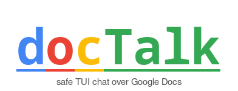

    

 

 

    

docTalk is a messaging app that uses Google Forms to send encrypted messages. Users choose a key to encrypt messages, which are only decrypted during reading. This ensures that all communication is private and secure, with the key shared among chat members for full control over privacy.
